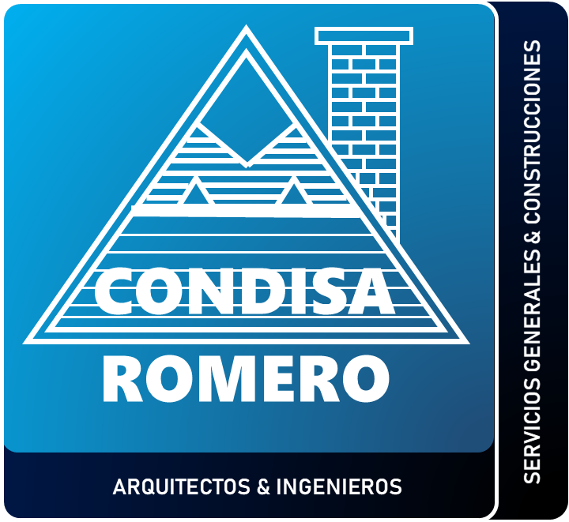

# 🏗️ Condisa Romero - Sitio Web Corporativo



## 📋 Descripción del Proyecto

Sitio web corporativo desarrollado para **Condisa Romero Servicios Generales & Construcciones S.A.C.**, empresa especializada en arquitectura, ingeniería y construcción. El proyecto utiliza React y Vite, presenta una interfaz moderna y responsiva, mostrando servicios, portafolio, blog y contacto.

## 🎯 Características Principales

- ✅ **Diseño Responsivo**: Adaptable a móviles, tablets y desktop
- ✅ **Navegación Intuitiva**: Menú fijo y desplegable con todos los servicios
- ✅ **Animaciones Suaves**: Efectos visuales y transiciones CSS
- ✅ **Contador Dinámico**: Estadísticas animadas de la empresa
- ✅ **Optimización SEO**: Meta tags y estructura semántica
- ✅ **Integración Social**: Enlaces a redes sociales y WhatsApp
- ✅ **Portafolio Visual**: Carrusel y galería de proyectos realizados
- ✅ **Blog**: Sección de artículos y noticias
- ✅ **Detalle de Servicios**: Página individual para cada servicio

## 🛠️ Tecnologías Utilizadas

### Frontend
- **React 18+**: SPA y componentes reutilizables
- **Vite**: Bundler y servidor de desarrollo rápido
- **CSS3**: Estilos avanzados, animaciones y media queries
- **Google Fonts**: Montserrat, Poppins, Roboto, Radio Canada
- **Iconos**: Remix Icons, Boxicons, Font Awesome

### Herramientas y Servicios
- **ESLint**: Linter para calidad de código
- **Imágenes WebP/JPEG/PNG**: Formatos optimizados
- **CDN**: Librerías externas para optimización

## 📁 Estructura del Proyecto

```
website-condisa-romero/
├── index.html                  # HTML base para Vite
├── package.json                # Dependencias y scripts
├── README.md                   # Documentación del proyecto
├── public/                     # Archivos estáticos
├── src/
│   ├── assets/                 # Imágenes y recursos
│   │   ├── img_projects/       # Imágenes de proyectos
│   │   ├── img_pages/          # Imágenes de páginas
│   │   ├── services-icon/      # Iconos de servicios
│   │   ├── services/           # Imágenes de servicios
│   │   └── projects_interiores/# Proyectos de interiorismo
│   ├── components/             # Navbar, Footer, etc.
│   ├── hooks/                  # Custom hooks
│   ├── pages/                  # Home, About, Service, Projects, Blog, Contact
│   ├── data/                   # Datos de servicios
│   ├── styles.css              # Estilos globales
│   └── cssServices.css         # Estilos específicos de servicios
└── eslint.config.js            # Configuración de ESLint
```

## 🚀 Instalación y Configuración

### Prerrequisitos
- Node.js 14+
- npm o yarn
- Navegador web moderno

### Pasos de Instalación

1. **Clonar el proyecto**
   ```bash
   git clone https://github.com/tu-usuario/website-condisa-romero.git
   cd website-condisa-romero
   ```

2. **Instalar dependencias**
   ```bash
   npm install
   ```

3. **Iniciar servidor de desarrollo**
   ```bash
   npm run dev
   ```
   Accede a [http://localhost:5173](http://localhost:5173)

4. **Build para producción**
   ```bash
   npm run build
   ```

## 🎨 Funcionalidades Implementadas

### Navegación
- Menú fijo y responsivo
- Submenú para servicios
- Navegación SPA con React Router

### Animaciones
- Contador animado en Home
- Efectos hover en botones y tarjetas
- Transiciones CSS en elementos clave

### Responsive Design
- Mobile First
- Media queries y breakpoints
- Flexbox y Grid para layouts

## 📱 Páginas Incluidas

### Páginas Principales
- **Inicio** (`Home.jsx`): Landing con servicios destacados y proyectos
- **Nosotros** (`About.jsx`): Historia, misión y visión
- **Servicios** (`Service.jsx`): Lista completa de servicios
- **Proyectos** (`Projects.jsx`): Portafolio visual y diseño de interiores
- **Blog** (`Blog.jsx`): Artículos y noticias
- **Contacto** (`Contact.jsx`): Información y redes sociales

### Páginas de Servicios
- Construcción en General
- Diseño de Interiores
- Planos de Obra
- Licencia de Construcción
- Declaratoria de Fábrica
- Independización
- Subdivisión de Lotes
- Prescripción Adquisitiva
- Defensa Civil
- Tasación
- Planos Eléctricos
- Planos Perimétricos

## 🔧 Personalización

### Modificar Colores
Edita las variables CSS en `src/styles.css`:
```css
:root {
    --primary-color: #tu-color-principal;
    --secondary-color: #tu-color-secundario;
    --accent-color: #tu-color-acento;
}
```

### Agregar Nuevos Servicios
1. Añade el servicio en `src/data/services.js`
2. Crea la página en `src/pages/`
3. Actualiza el menú en `Navbar.jsx`
4. Incluye la imagen en `src/assets/services/`

### Modificar Contenido
- Textos: Edita los archivos JSX correspondientes
- Imágenes: Reemplaza en `src/assets/`
- Estilos: Modifica `src/styles.css` y `src/cssServices.css`

## 📊 Optimizaciones Implementadas

### Performance
- Imágenes optimizadas (WebP/JPEG)
- CSS minificado
- Librerías por CDN
- Lazy loading en imágenes de proyectos

### SEO
- Meta tags en `index.html`
- HTML5 semántico
- Alt text en imágenes

## 🌐 Integraciones

### Redes Sociales
- Facebook, WhatsApp, Instagram, YouTube, Twitter
- Botón de contacto directo

### Servicios Externos
- Google Fonts
- Remix Icons, Boxicons, Font Awesome

## 🐛 Solución de Problemas

### Problemas Comunes

**Las imágenes no cargan**
- Verifica rutas en `src/assets/`
- Confirma que los archivos existen

**El menú no funciona en móvil**
- Revisa la lógica en `Navbar.jsx`
- Verifica la consola del navegador

**Los estilos no se aplican**
- Confirma importación de `src/styles.css`
- Verifica sintaxis CSS

## 📈 Próximas Mejoras

- [ ] Implementar modo oscuro
- [ ] Agregar formulario de contacto
- [ ] Optimizar para Core Web Vitals
- [ ] Implementar PWA
- [ ] Más animaciones y microinteracciones
- [ ] Mejorar accesibilidad

## 👨‍💻 Desarrollador

**MiGaNg** - Desarrollador Frontend
- Proyecto desarrollado como primer sitio web corporativo con React y Vite

## 📄 Licencia

Este proyecto es propiedad de **Condisa Romero Servicios Generales & Construcciones S.A.C.**

---

## 🎓 Lo que Aprendí en Este Proyecto

Como mi primer proyecto web con React, aprendí:

### React
- Componentes reutilizables
- Estado y props
- React Router para navegación SPA

### CSS
- Flexbox y Grid
- Animaciones y transiciones
- Responsive design y media queries
- Variables CSS

### JavaScript
- Manipulación de estado y eventos
- Hooks personalizados

### Conceptos Generales
- Organización de archivos
- Optimización de imágenes
- Integración de servicios externos
- Mejores prácticas de desarrollo web

---

*¡Gracias por revisar mi primer proyecto web! 🚀*
